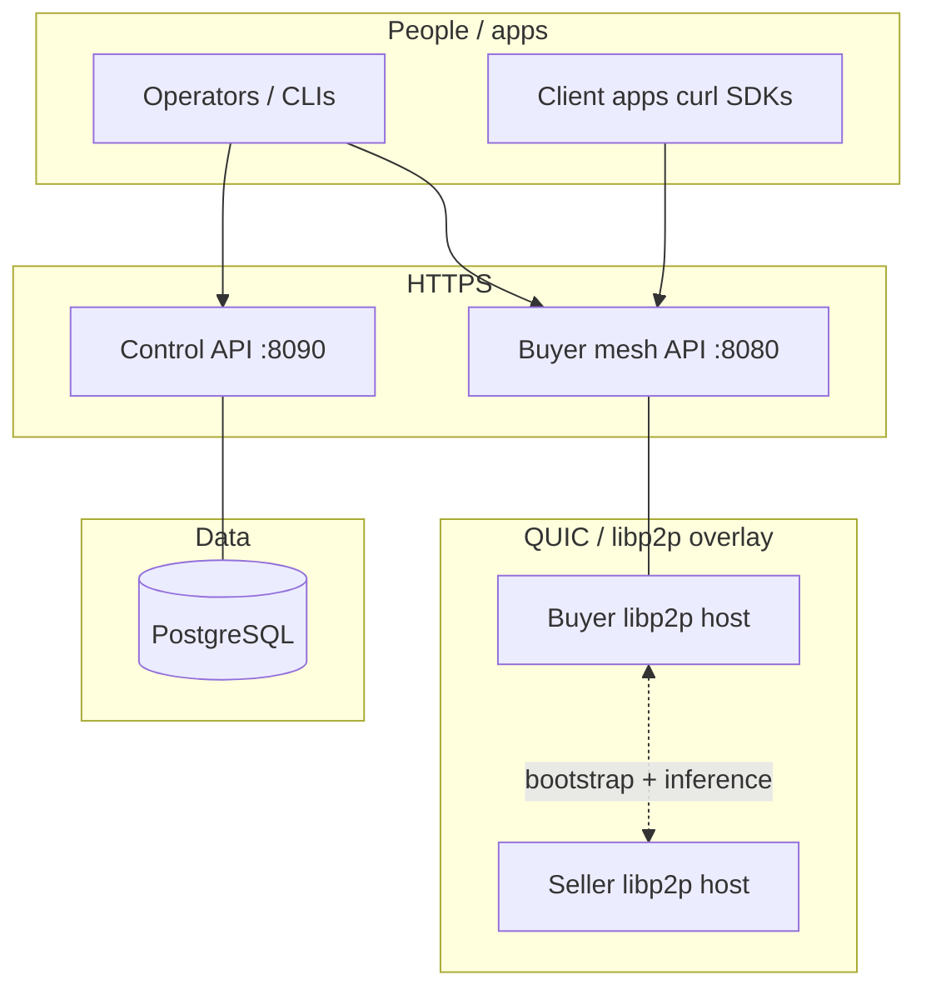
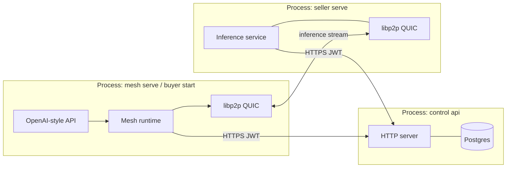
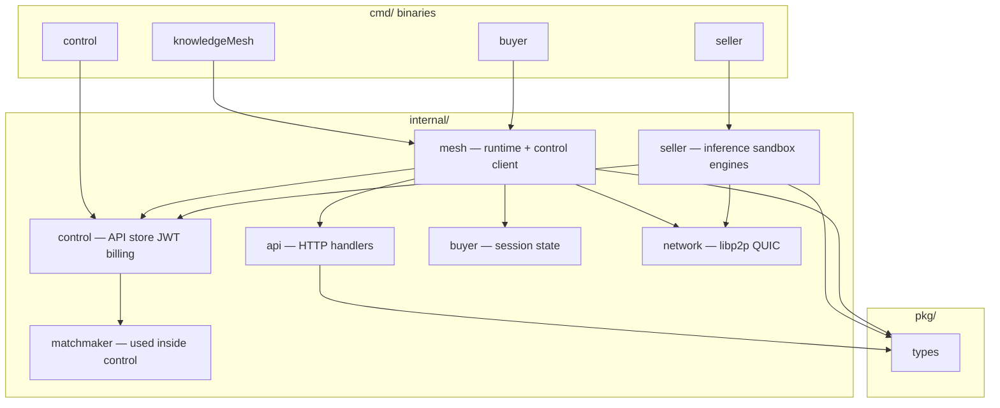
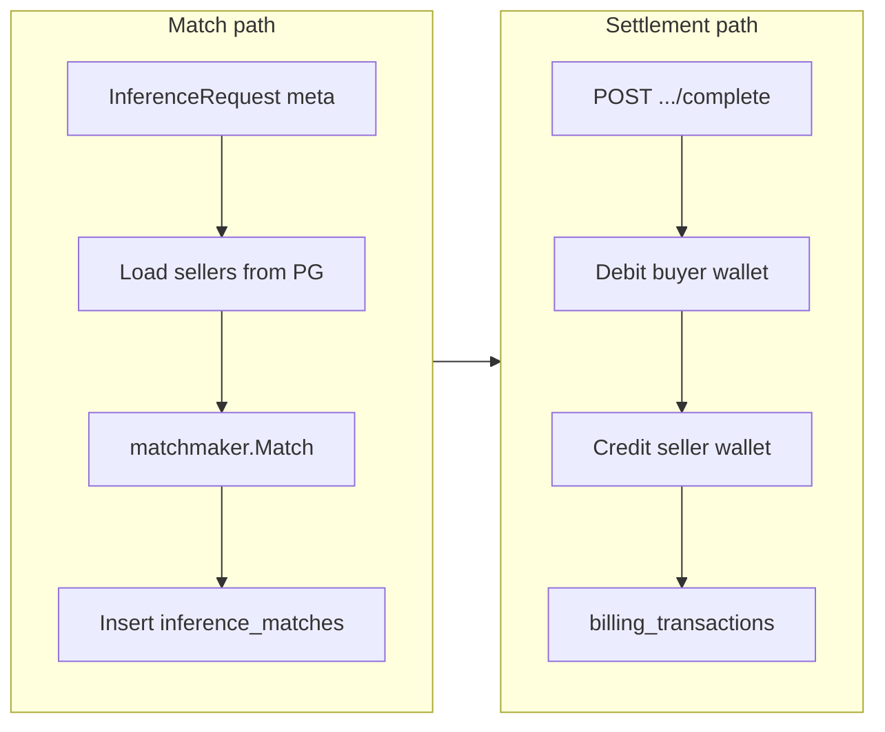
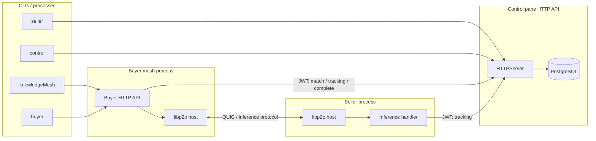
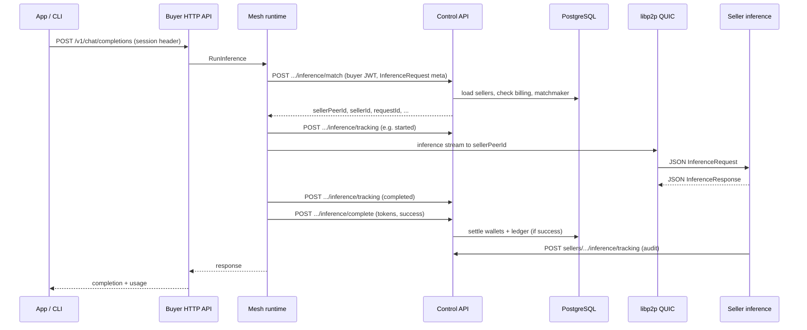

# knowledgeMesh architecture

This document describes how the main components fit together and how requests flow through the system. For a **command-by-command CLI table** and copy-paste examples, see [README.md](./README.md) (sections *CLI reference* and *Examples and quick binary check*).

## Visual architecture (diagrams)

### System context (who talks to what)

Big-picture: operators and apps use **HTTPS** to the control API and buyer API; buyer and seller nodes also use **QUIC/libp2p** for inference traffic.

### Runtime processes (one machine view)

Typical dev setup: three long-running processes. **Registration** and **billing** use HTTP to the control API; **prompt execution** uses P2P between mesh and seller.

### Code layers (`cmd` → `internal` → `pkg`)

### Billing and match (control plane)

---

## High-level view

- **Control pane** (`control api`) is the source of truth for accounts (buyers and sellers), seller models and duty, **billing** (wallets, quotas, transaction ledger), and **matchmaking** inputs (on-duty sellers with presence loaded from PostgreSQL).
- **Buyer mesh** (`knowledgeMesh mesh serve` or `buyer start`) exposes OpenAI/Anthropic-style HTTP APIs, holds the buyer’s libp2p host, and calls the control API for **match → track → settle** around each inference.
- **Seller** (`seller serve`) exposes inference over libp2p and reports execution metadata back to the control pane.
- **`knowledgeMesh serve`** (no mesh) runs the same HTTP API with **mock inference** only (no `MeshRuntime`); useful for local UI tests without PostgreSQL.

## Components

| Area | Package / binary | Role |
|------|------------------|------|
| Control HTTP | `cmd/control`, `internal/control` | REST API, JWT issuance, Postgres persistence, billing, inference orchestration metadata |
| Matchmaking | `internal/matchmaker` | Selects a seller from a candidate list (skill, duty, price cap; then lowest price, then reputation). Invoked **inside** the control pane for `/buyers/me/inference/match`. |
| Buyer mesh | `internal/mesh`, `internal/api` | Session from control login; calls control for match and billing completion; runs libp2p inference streams |
| Seller runtime | `internal/seller` | Sandbox + model engines; inference over `/knowledgemesh/inference/1.0.0`; optional control tracking callbacks |
| Network | `internal/network` | QUIC libp2p host, bootstrap connect, request/response streams |

### `cmd/` binaries (entrypoints)

| Binary | Main commands | Maps to |
|--------|----------------|--------|
| `knowledgeMesh` | `serve`, `mesh serve` | `cmd/knowledgeMesh` → `internal/sandbox`, `internal/mesh` |
| `buyer` | `register`, `start`, `prompt` | `cmd/buyer` → `internal/buyer`, `internal/mesh` |
| `seller` | `register`, `serve` | `cmd/seller` → `internal/seller`, `internal/control` client |
| `control` | `api`, `start` | `cmd/control` → `internal/control` HTTP server or libp2p control protocol |
| `demo` | `run` | placeholder |

Registration and login for buyers and sellers in production flows go through **`control api`** (PostgreSQL), invoked via `buyer register`, `seller register`, or the HTTP routes.

## Data stores (PostgreSQL)

Schema changes are **versioned migrations** (`internal/control/migrations/*.sql`, [golang-migrate](https://github.com/golang-migrate/migrate)), applied on `control api` startup. Migration history is stored in **`schema_migrations`** (managed by the tool).

| Data | Tables (conceptual) |
|------|---------------------|
| Identity | `buyer_users`, `seller_users` |
| Seller offers | `seller_models` (skills, limits, rates, active flag) |
| Presence | `seller_users.peer_id` (updated via presence API) |
| Billing | `buyer_billing`, `seller_billing` (wallet, quota, tokens used) |
| Ledger | `billing_transactions` (typed debits/credits and audit entries) |
| Inference | `inference_matches` (request id, buyer/seller, peer id, settlement flag) |

JWTs distinguish **buyer** vs **seller** subjects so tokens are not interchangeable across roles.

## End-to-end inference flow

### 1. Prerequisites

1. **Control API** running with `DATABASE_URL` (migrations on startup).
2. **Buyer** registered (`POST /v1/control/buyers/register` or `buyer register`).
3. **Seller** registered, models declared, **on duty**, and **presence** posted so PostgreSQL has a routable libp2p peer id.
4. **Buyer mesh** (`mesh serve`) logged in to control; **seller** (`seller serve`) logged in to control.
5. Buyer mesh process started with `--bootstrap` so it can reach the seller’s multiaddr (dial path).

### 2. Sequence (happy path)

Each inference uses a **short-lived stream**: the connection is used for one request/response pair, then released.

### 3. What “matchmaking” means here

The matchmaker does **not** compute geographic distance. It filters candidates that are on duty, within price constraints, and expose the requested skill, then ranks by **lowest price** and **higher reputation** as a tie-breaker. Candidates come from PostgreSQL (sellers with `peer_id` and active models).

### 4. Billing (control pane)

- **Match** may reject the buyer if wallet/quota checks fail (HTTP 402 from control).
- **Complete** (buyer) applies settlement: debit buyer wallet, credit seller wallet, append `billing_transactions`, mark the `inference_matches` row settled (idempotent per `requestId`).
- **Tracking** endpoints append **audit** ledger rows (e.g. `inference_tracking`) with zero amount and JSON details where applicable.

## Related protocols

| Protocol ID | Use |
|-------------|-----|
| `/knowledgemesh/inference/1.0.0` | JSON `InferenceRequest` / `InferenceResponse` over a single stream |
| `/knowledgemesh/control/1.0.0` | Optional libp2p control node (`control start`), separate from HTTP control API |

## CLI registration

Seller and buyer **account** registration uses the **control pane** only:

- **CLI:** `buyer register`, `seller register` (both call `POST /v1/control/.../register`).
- **Buyer mesh** does not register users by itself; run `buyer register` (or the HTTP route) before `mesh serve` / `buyer start`.

There is no separate local-file registration CLI. The [README.md](./README.md) *CLI reference* lists every command.

### Optional libp2p control stream

`control start` exposes a small JSON ping handler on `/knowledgemesh/control/1.0.0`. This is **orthogonal** to the HTTP control API and is not required for buyer/seller registration or inference.
